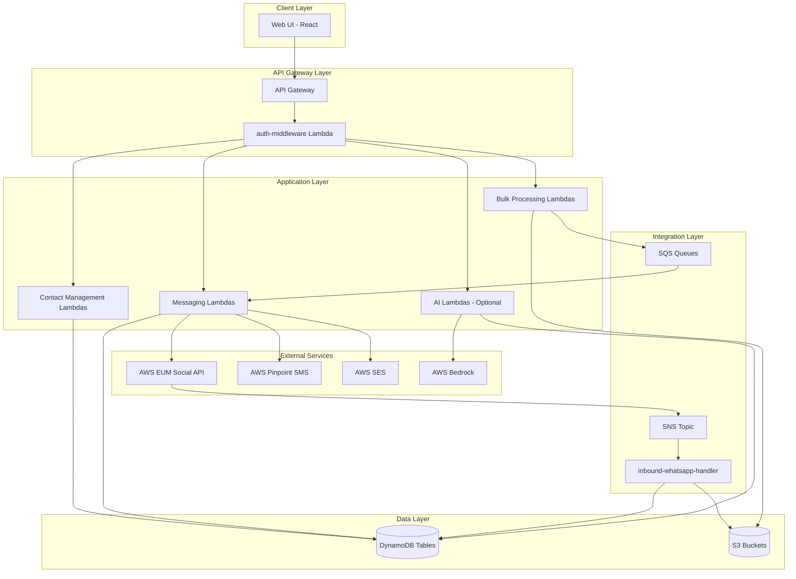
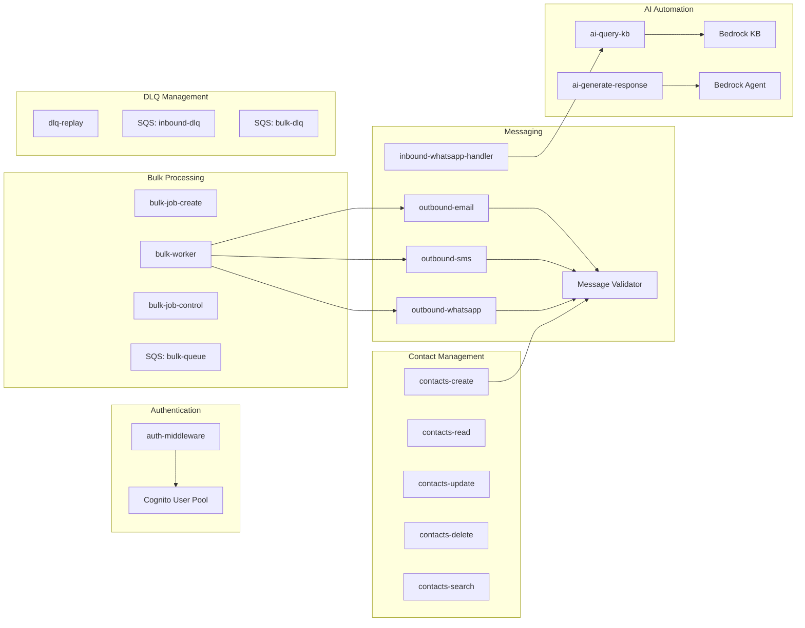
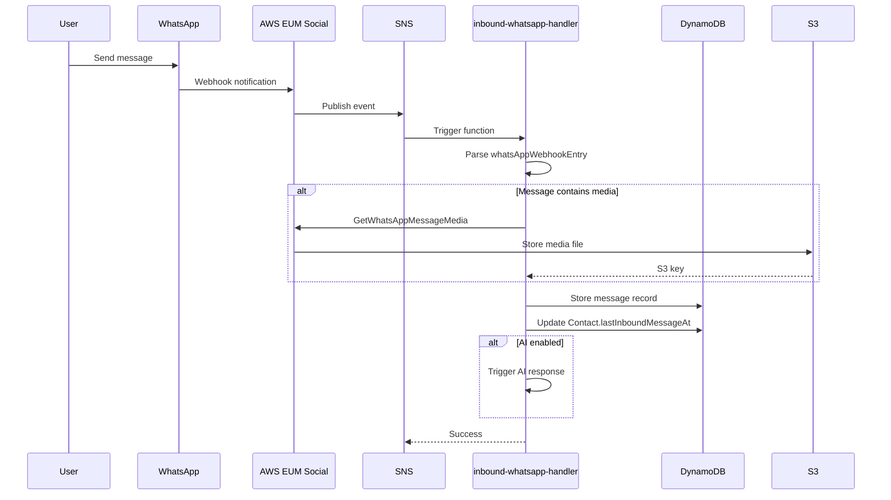
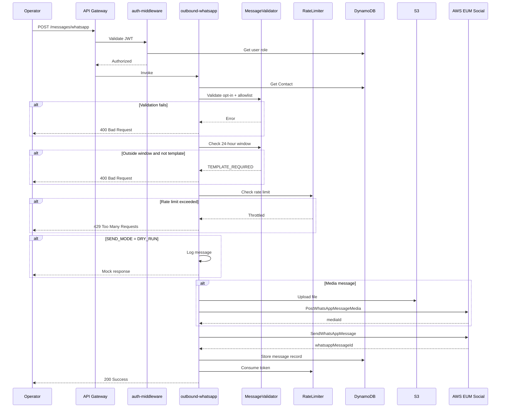
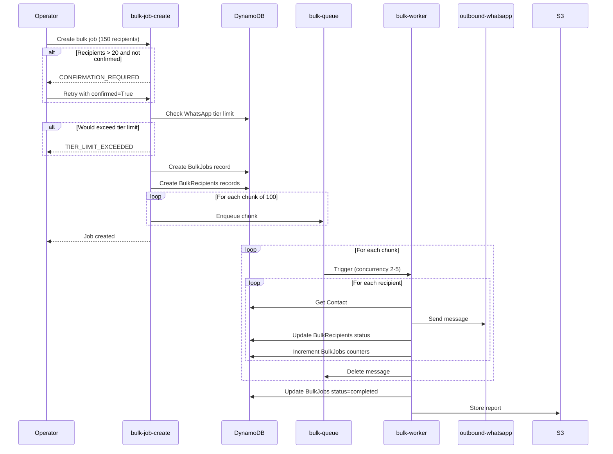

# Design Document: WECARE.DIGITAL Admin Platform

## Overview

The WECARE.DIGITAL Admin Platform is a serverless, multi-channel messaging system built on AWS infrastructure. The platform enables organizations to manage contacts and send messages via WhatsApp (using AWS End User Messaging Social API), SMS (via AWS Pinpoint), and Email (via AWS SES). The architecture prioritizes message delivery safety through strict opt-in validation and allowlist verification, ensuring compliance with communication regulations.

**Core Design Principles**:
- **Safety First**: Fail-closed validation prevents unauthorized message delivery
- **Serverless Architecture**: AWS Lambda functions with event-driven processing
- **Separation of Concerns**: Clear boundaries between authentication, validation, messaging, and storage layers
- **Environment Isolation**: DRY_RUN mode for non-production environments prevents accidental live messaging
- **Scalability**: Asynchronous bulk processing with SQS queues and configurable concurrency
- **Observability**: Centralized logging and metrics for monitoring and troubleshooting

**Technology Stack**:
- **Backend**: Python 3.12 with FastAPI for API endpoints
- **Infrastructure**: AWS Amplify Gen 2 (Infrastructure as Code)
- **Authentication**: AWS Cognito User Pool with JWT validation
- **Database**: Amazon DynamoDB (11 tables with PAY_PER_REQUEST billing)
- **Messaging**: AWS End User Messaging Social (WhatsApp), AWS Pinpoint (SMS), AWS SES (Email)
- **Storage**: Amazon S3 for media files and reports
- **Queuing**: Amazon SQS for asynchronous processing
- **Monitoring**: Amazon CloudWatch for logs and metrics
- **Optional AI**: AWS Bedrock Knowledge Base and Agent for automated responses

## Architecture

### High-Level Architecture Diagram



### Architecture Layers

**1. Client Layer**
- React-based web application
- Responsive design (mobile-first, 320px minimum width)
- Sidebar navigation with menu items: Pay, Link, Forms, Docs, Invoice, DM, Contacts, Bulk Messaging, Agent
- Helvetica Light font, white background, black buttons with 13px border radius

**2. API Gateway Layer**
- AWS API Gateway with JWT authorization
- `auth-middleware` Lambda validates JWT tokens against Cognito User Pool
- RBAC enforcement: Viewer (read-only), Operator (read-write), Admin (full access)
- Returns HTTP 403 for unauthorized actions

**3. Application Layer**
- **Contact Management**: CRUD operations on contact records
- **Messaging**: Send messages via WhatsApp, SMS, Email with validation
- **Bulk Processing**: Asynchronous bulk message operations with progress tracking
- **AI Automation**: Optional Bedrock integration for automated responses

**4. Integration Layer**
- **Inbound Processing**: SNS topic receives WhatsApp webhooks, Lambda processes and stores
- **Queue Management**: SQS queues for bulk processing and DLQ for failed messages
- **External APIs**: AWS EUM Social, Pinpoint SMS, SES for message delivery

**5. Data Layer**
- **DynamoDB**: 11 tables for contacts, messages, jobs, users, audit logs, etc.
- **S3**: Media files (WhatsApp images/videos) and bulk message reports

### Deployment Architecture

**AWS Amplify Gen 2 Deployment**:
- Infrastructure defined in `amplify/` folder
- Branch-based deployments:
  - `main` → Production (SEND_MODE=LIVE)
  - `release/*` → Staging (SEND_MODE=DRY_RUN)
  - `feature/*` → Preview (SEND_MODE=DRY_RUN)
  - `hotfix/*` → Production (SEND_MODE=LIVE)
- Custom domain: `https://base.wecare.digital`
- SSL certificate: `9df65f48-cdff-4f45-8e6d-f33c8c0beb92`

**Environment Configuration**:
- Environment variables configured per Lambda function in `amplify/backend.ts`
- Secrets stored in Amplify Secrets (not environment variables)
- Branch-specific variables for SEND_MODE enforcement

## Components and Interfaces

### Component Diagram



### Lambda Functions

#### 1. auth-middleware

**Purpose**: JWT validation and RBAC enforcement

**Input**:
```python
{
    "headers": {
        "Authorization": "Bearer <jwt_token>"
    },
    "requestContext": {
        "http": {
            "method": "GET|POST|PUT|DELETE",
            "path": "/api/contacts"
        }
    }
}
```

**Output**:
```python
{
    "isAuthorized": True,
    "context": {
        "userId": "user-id",
        "email": "user@example.com",
        "role": "Viewer|Operator|Admin"
    }
}
```

**Logic**:
1. Extract JWT from Authorization header
2. Validate JWT signature against Cognito JWKS endpoint
3. Extract user claims (userId, email, role)
4. Check role permissions for requested operation
5. Return authorization decision

**Environment Variables**:
- `COGNITO_USER_POOL_ID`: us-east-1_CC9u1fYh6
- `AWS_REGION`: us-east-1

#### 2. contacts-create

**Purpose**: Create new contact with opt-in defaults

**Input**:
```python
{
    "name": "John Doe",
    "phone": "+1234567890",  # Optional
    "email": "john@example.com",  # Optional
    "optInWhatsApp": False,  # Default
    "optInSms": False,  # Default
    "optInEmail": False  # Default
}
```

**Output**:
```python
{
    "contactId": "uuid",
    "name": "John Doe",
    "phone": "+1234567890",
    "email": "john@example.com",
    "optInWhatsApp": False,
    "optInSms": False,
    "optInEmail": False,
    "createdAt": "2026-01-17T12:00:00Z",
    "updatedAt": "2026-01-17T12:00:00Z"
}
```

**Logic**:
1. Validate at least one of {phone, email} is provided
2. Generate unique contactId (UUID)
3. Set all opt-in flags to False by default
4. Set createdAt and updatedAt timestamps
5. Store in DynamoDB Contacts table
6. Return created contact record

**Validation Rules**:
- Phone format: E.164 format (e.g., +1234567890)
- Email format: RFC 5322 compliant
- Name: Required, 1-255 characters

#### 3. contacts-read

**Purpose**: Retrieve contact details by contactId

**Input**:
```python
{
    "contactId": "uuid"
}
```

**Output**:
```python
{
    "contactId": "uuid",
    "name": "John Doe",
    "phone": "+1234567890",
    "email": "john@example.com",
    "optInWhatsApp": True,
    "optInSms": False,
    "optInEmail": True,
    "lastInboundMessageAt": "2026-01-17T10:00:00Z",
    "createdAt": "2026-01-17T12:00:00Z",
    "updatedAt": "2026-01-17T12:00:00Z"
}
```

**Logic**:
1. Query DynamoDB Contacts table by contactId (PK)
2. Filter out soft-deleted records (deletedAt is null)
3. Return contact record or 404 if not found


#### 4. contacts-update

**Purpose**: Update contact information and opt-in status

**Input**:
```python
{
    "contactId": "uuid",
    "name": "John Doe Updated",  # Optional
    "phone": "+1234567890",  # Optional
    "email": "john.new@example.com",  # Optional
    "optInWhatsApp": True,  # Optional
    "optInSms": False,  # Optional
    "optInEmail": True  # Optional
}
```

**Output**:
```python
{
    "contactId": "uuid",
    "name": "John Doe Updated",
    "phone": "+1234567890",
    "email": "john.new@example.com",
    "optInWhatsApp": True,
    "optInSms": False,
    "optInEmail": True,
    "updatedAt": "2026-01-17T13:00:00Z"
}
```

**Logic**:
1. Validate contactId exists and not soft-deleted
2. Update only provided fields
3. Set updatedAt timestamp
4. Use DynamoDB UpdateItem with conditional expression
5. Return updated contact record

#### 5. contacts-delete

**Purpose**: Soft delete contact by setting deletedAt timestamp

**Input**:
```python
{
    "contactId": "uuid"
}
```

**Output**:
```python
{
    "contactId": "uuid",
    "deletedAt": "2026-01-17T14:00:00Z"
}
```

**Logic**:
1. Validate contactId exists
2. Set deletedAt timestamp (soft delete)
3. Do not physically delete record
4. Return confirmation

#### 6. contacts-search

**Purpose**: Search contacts by name, phone, or email

**Input**:
```python
{
    "query": "john",
    "limit": 50,  # Optional, default 50
    "nextToken": "pagination-token"  # Optional
}
```

**Output**:
```python
{
    "contacts": [
        {
            "contactId": "uuid",
            "name": "John Doe",
            "phone": "+1234567890",
            "email": "john@example.com",
            "optInWhatsApp": True
        }
    ],
    "nextToken": "pagination-token"  # If more results
}
```

**Logic**:
1. Perform case-insensitive search on name, phone, email fields
2. Use DynamoDB Scan with FilterExpression (contains)
3. Filter out soft-deleted records
4. Paginate results with limit and nextToken
5. Return matching contacts

**Performance Note**: For large datasets, consider implementing DynamoDB GSI on searchable fields or using Amazon OpenSearch for full-text search.

#### 7. inbound-whatsapp-handler

**Purpose**: Process WhatsApp inbound messages from SNS webhook

**Input** (SNS Event):
```python
{
    "Records": [{
        "Sns": {
            "Message": json.dumps({
                "context": {
                    "MetaWabaIds": [{"wabaId": "...", "arn": "..."}],
                    "MetaPhoneNumberIds": [{"metaPhoneNumberId": "...", "arn": "..."}]
                },
                "whatsAppWebhookEntry": "{...JSON STRING...}",
                "aws_account_id": "809904170947",
                "message_timestamp": "2026-01-17T12:00:00.000Z",
                "messageId": "uuid"
            })
        }
    }]
}
```

**WhatsApp Webhook Payload** (decoded from whatsAppWebhookEntry):
```python
{
    "id": "webhook-entry-id",
    "changes": [{
        "value": {
            "messaging_product": "whatsapp",
            "metadata": {
                "display_phone_number": "+1234567890",
                "phone_number_id": "phone-number-id"
            },
            "messages": [{
                "from": "sender-phone-number",
                "id": "whatsapp-message-id",
                "timestamp": "unix-timestamp",
                "type": "text|image|video|audio|document",
                "text": {"body": "message content"},
                "image": {"id": "media-id", "mime_type": "image/jpeg"}
            }],
            "statuses": [{
                "id": "message-id",
                "status": "sent|delivered|read|failed",
                "timestamp": "unix-timestamp",
                "recipient_id": "recipient-phone"
            }]
        },
        "field": "messages"
    }]
}
```

**Logic**:
1. Parse SNS event and extract Message
2. Decode whatsAppWebhookEntry JSON string
3. Process messages array:
   - Extract sender phone number
   - Lookup or create Contact record
   - Store message in Messages table
   - Update Contact.lastInboundMessageAt (for 24-hour window tracking)
   - If media: Call GetWhatsAppMessageMedia API, store in S3
4. Process statuses array:
   - Update existing message status in Messages table
5. Deduplicate using whatsappMessageId
6. On error: Send to inbound-dlq SQS queue

**Environment Variables**:
- `MEDIA_BUCKET`: auth.wecare.digital
- `MEDIA_INBOUND_PREFIX`: whatsapp-media/whatsapp-media-incoming/
- `WHATSAPP_PHONE_NUMBER_ID_1`: phone-number-id-baa217c3f11b4ffd956f6f3afb44ce54
- `WHATSAPP_PHONE_NUMBER_ID_2`: phone-number-id-1447bc72d1b040f4bf2341c9e04b2e06


#### 8. outbound-whatsapp

**Purpose**: Send WhatsApp text and media messages

**Input**:
```python
{
    "contactId": "uuid",
    "messageType": "text|image|video|audio|document",
    "content": "Message text",  # For text messages
    "mediaUrl": "s3://bucket/key",  # For media messages
    "caption": "Media caption"  # Optional for media
}
```

**Output**:
```python
{
    "messageId": "uuid",
    "whatsappMessageId": "whatsapp-msg-id",
    "status": "sent",
    "timestamp": "2026-01-17T12:00:00Z"
}
```

**Logic**:
1. Retrieve Contact record by contactId
2. **Validation** (fail-closed):
   - Check optInWhatsApp == True (Requirement 3.1)
   - Check originationPhoneNumberId in allowlist (Requirement 3.2)
   - Check 24-hour customer service window (Requirement 16)
   - If outside window and not template: Reject with "TEMPLATE_REQUIRED"
3. **Check SEND_MODE**:
   - If DRY_RUN: Log message details, skip API call, return mock response
   - If LIVE: Proceed to send
4. **For media messages**:
   - Upload file to S3 whatsapp-media/whatsapp-media-outgoing/
   - Call PostWhatsAppMessageMedia API with sourceS3File
   - Get mediaId from response
5. **Send message**:
   - Call SendWhatsAppMessage API (POST /v1/whatsapp/send)
   - Pass originationPhoneNumberId, metaApiVersion "v20.0"
   - Include mediaId for media messages
6. **Store record**:
   - Create record in Messages table
   - Set status to "sent"
   - Store whatsappMessageId from API response
7. **Rate limiting**:
   - Enforce 80 messages/second per phone number
   - Use token bucket algorithm with DynamoDB RateLimitTrackers table
8. **Error handling**:
   - On API error: Store error details, set status to "failed"
   - Return error to caller

**Environment Variables**:
- `SEND_MODE`: DRY_RUN or LIVE
- `WHATSAPP_PHONE_NUMBER_ID_1`: phone-number-id-baa217c3f11b4ffd956f6f3afb44ce54
- `WHATSAPP_PHONE_NUMBER_ID_2`: phone-number-id-1447bc72d1b040f4bf2341c9e04b2e06
- `MEDIA_BUCKET`: auth.wecare.digital
- `MEDIA_OUTBOUND_PREFIX`: whatsapp-media/whatsapp-media-outgoing/

**AWS EUM Social API Call**:
```python
import boto3

client = boto3.client('socialmessaging', region_name='us-east-1')

response = client.send_whatsapp_message(
    originationPhoneNumberId='phone-number-id-baa217c3f11b4ffd956f6f3afb44ce54',
    metaApiVersion='v20.0',
    message=base64.b64encode(json.dumps({
        "messaging_product": "whatsapp",
        "to": "+1234567890",
        "type": "text",
        "text": {"body": "Hello World"}
    }).encode()).decode()
)

whatsapp_message_id = response['messageId']
```

#### 9. outbound-sms

**Purpose**: Send SMS messages via AWS Pinpoint

**Input**:
```python
{
    "contactId": "uuid",
    "content": "SMS message text"
}
```

**Output**:
```python
{
    "messageId": "uuid",
    "status": "sent",
    "timestamp": "2026-01-17T12:00:00Z"
}
```

**Logic**:
1. Retrieve Contact record by contactId
2. **Validation**:
   - Check optInSms == True (Requirement 6.1)
   - Validate phone number exists
3. **Check SEND_MODE**:
   - If DRY_RUN: Log and return mock response
   - If LIVE: Proceed to send
4. **Send SMS**:
   - Use AWS Pinpoint SMS Pool: pool-6fbf5a5f390d4eeeaa7dbae39d78933e
   - Support up to 1600 characters with automatic segmentation
5. **Rate limiting**:
   - Enforce 5 messages/second
6. **Store record**:
   - Create record in Messages table
7. **Error handling**:
   - On error: Store error details, set status to "failed"

**Environment Variables**:
- `SEND_MODE`: DRY_RUN or LIVE
- `SMS_POOL_ID`: pool-6fbf5a5f390d4eeeaa7dbae39d78933e

#### 10. outbound-email

**Purpose**: Send email messages via AWS SES

**Input**:
```python
{
    "contactId": "uuid",
    "subject": "Email subject",
    "bodyText": "Plain text body",  # Optional
    "bodyHtml": "<html>...</html>"  # Optional
}
```

**Output**:
```python
{
    "messageId": "uuid",
    "sesMessageId": "ses-msg-id",
    "status": "sent",
    "timestamp": "2026-01-17T12:00:00Z"
}
```

**Logic**:
1. Retrieve Contact record by contactId
2. **Validation**:
   - Check optInEmail == True (Requirement 7.1)
   - Validate email address exists
3. **Check SEND_MODE**:
   - If DRY_RUN: Log and return mock response
   - If LIVE: Proceed to send
4. **Send Email**:
   - Use AWS SES with verified sender: one@wecare.digital
   - Support both plain text and HTML formats
5. **Rate limiting**:
   - Enforce 10 messages/second
6. **Store record**:
   - Create record in Messages table
7. **Error handling**:
   - On error: Store error details, set status to "failed"

**Environment Variables**:
- `SEND_MODE`: DRY_RUN or LIVE
- `SES_SENDER_EMAIL`: one@wecare.digital
- `SES_SENDER_NAME`: WECARE.DIGITAL


#### 11. bulk-job-create

**Purpose**: Create and validate bulk message jobs

**Input**:
```python
{
    "channel": "whatsapp|sms|email",
    "messageType": "text|image|video",
    "content": "Message content",
    "recipientContactIds": ["uuid1", "uuid2", ...],
    "confirmed": False  # Required True if >20 recipients
}
```

**Output**:
```python
{
    "jobId": "uuid",
    "status": "pending",
    "totalRecipients": 150,
    "createdAt": "2026-01-17T12:00:00Z"
}
```

**Logic**:
1. Validate input parameters
2. **Confirmation gate** (Requirement 8.1):
   - If recipientContactIds.length > 20 and confirmed != True:
     - Return error: "CONFIRMATION_REQUIRED"
3. **WhatsApp tier limit check** (Requirement 13.10):
   - Query RateLimitTrackers for current 24-hour window usage
   - If (current_usage + recipient_count) > tier_limit:
     - Reject job with error: "TIER_LIMIT_EXCEEDED"
4. **Create job record**:
   - Generate jobId (UUID)
   - Store in BulkJobs table with status "pending"
   - Store recipients in BulkRecipients table
5. **Enqueue chunks**:
   - Split recipients into chunks of 100
   - Send each chunk to bulk-queue SQS
6. Return job details

**Environment Variables**:
- `BULK_QUEUE_URL`: (generated by Amplify)
- `BULK_CONFIRMATION_THRESHOLD`: 20

#### 12. bulk-worker

**Purpose**: Process bulk message queue chunks

**Trigger**: SQS bulk-queue messages

**Input** (SQS Message):
```python
{
    "jobId": "uuid",
    "channel": "whatsapp",
    "messageType": "text",
    "content": "Message content",
    "recipientContactIds": ["uuid1", "uuid2", ...]  # Max 100
}
```

**Logic**:
1. Parse SQS message
2. **For each recipient**:
   - Retrieve Contact record
   - Apply validation rules (opt-in, allowlist)
   - Call appropriate outbound Lambda (outbound-whatsapp, outbound-sms, outbound-email)
   - Update BulkRecipients record with status
   - Update BulkJobs progress counters (sentCount, failedCount)
3. **Rate limiting**:
   - Respect channel-specific rate limits
   - Use exponential backoff for throttling
4. **Error handling**:
   - On chunk failure: Send to bulk-dlq
   - Continue processing remaining recipients
5. **Job completion**:
   - When all chunks processed: Update BulkJobs status to "completed"
   - Generate report and store in S3 stream.wecare.digital

**Concurrency**: Reserved concurrency 2-5 (configured in Amplify)

**Environment Variables**:
- `REPORT_BUCKET`: stream.wecare.digital
- `REPORT_PREFIX`: base-wecare-digital/reports/

#### 13. bulk-job-control

**Purpose**: Handle pause/resume/cancel operations for bulk jobs

**Input**:
```python
{
    "jobId": "uuid",
    "action": "pause|resume|cancel"
}
```

**Output**:
```python
{
    "jobId": "uuid",
    "status": "paused|resumed|cancelled",
    "timestamp": "2026-01-17T12:00:00Z"
}
```

**Logic**:
1. Validate jobId exists
2. **Pause**:
   - Update BulkJobs status to "paused"
   - Stop processing new chunks (bulk-worker checks status)
3. **Resume**:
   - Update BulkJobs status to "pending"
   - Re-enqueue unprocessed chunks
4. **Cancel**:
   - Update BulkJobs status to "cancelled"
   - Purge remaining messages from bulk-queue for this jobId
   - Generate partial report
5. Return updated status

#### 14. dlq-replay

**Purpose**: Retry failed messages from DLQ

**Input**:
```python
{
    "queueName": "inbound-dlq|bulk-dlq",
    "batchSize": 100,  # Max 100
    "maxRetries": 5
}
```

**Output**:
```python
{
    "replayed": 75,
    "failed": 5,
    "skipped": 20  # Exceeded max retries
}
```

**Logic**:
1. Receive messages from specified DLQ (up to batchSize)
2. **For each message**:
   - Check retry counter
   - If retryCount >= maxRetries: Skip and delete from DLQ
   - Otherwise: Apply original processing logic
   - If success: Delete from DLQ
   - If failure: Increment retryCount, return to DLQ
3. **Deduplication**:
   - Use messageId to prevent duplicate processing
   - Check Messages table for existing record
4. Return replay statistics

**Environment Variables**:
- `INBOUND_DLQ_URL`: (generated by Amplify)
- `BULK_DLQ_URL`: (generated by Amplify)

#### 15. ai-query-kb (Optional)

**Purpose**: Query Bedrock Knowledge Base for relevant information

**Input**:
```python
{
    "query": "User question or message content",
    "messageId": "uuid"
}
```

**Output**:
```python
{
    "results": [
        {
            "content": "Relevant knowledge base content",
            "source": "s3://bucket/key",
            "score": 0.95
        }
    ]
}
```

**Logic**:
1. Call Bedrock RetrieveAndGenerate API
2. Pass query to Knowledge Base FZBPKGTOYE
3. Return top results with relevance scores
4. Store interaction in AIInteractions table

**Environment Variables**:
- `BEDROCK_KB_ID`: FZBPKGTOYE

#### 16. ai-generate-response (Optional)

**Purpose**: Generate automated response suggestions using Bedrock Agent

**Input**:
```python
{
    "messageId": "uuid",
    "inboundContent": "User message",
    "context": {
        "contactId": "uuid",
        "previousMessages": [...]
    }
}
```

**Output**:
```python
{
    "suggestedResponse": "AI-generated response",
    "confidence": 0.85,
    "requiresApproval": True
}
```

**Logic**:
1. Call Bedrock Agent HQNT0JXN8G
2. Pass message content and context
3. Generate response suggestion
4. Store in AIInteractions table with approved=False
5. Return suggestion to operator for approval
6. **Never auto-send**: Always require operator approval

**Environment Variables**:
- `BEDROCK_AGENT_ID`: HQNT0JXN8G
- `BEDROCK_AGENT_ALIAS_ID`: (generated during deployment)


### Message Validator Component

**Purpose**: Centralized validation logic for message delivery safety

**Interface**:
```python
class MessageValidator:
    def validate_whatsapp(self, contact: Contact, phone_number_id: str) -> ValidationResult:
        """
        Validates WhatsApp message delivery requirements.
        
        Args:
            contact: Contact record with opt-in status
            phone_number_id: Origination phone number ID
            
        Returns:
            ValidationResult with success/failure and error details
        """
        pass
    
    def validate_sms(self, contact: Contact) -> ValidationResult:
        """Validates SMS message delivery requirements."""
        pass
    
    def validate_email(self, contact: Contact) -> ValidationResult:
        """Validates Email message delivery requirements."""
        pass
    
    def check_customer_service_window(self, contact: Contact) -> bool:
        """
        Checks if contact is within 24-hour customer service window.
        
        Returns:
            True if within window, False otherwise
        """
        pass
```

**Validation Logic**:

**WhatsApp Validation** (Fail-Closed):
1. Check contact.optInWhatsApp == True
   - If False: Return error "OPT_IN_REQUIRED"
2. Check phone_number_id in ALLOWLIST
   - If not in list: Return error "PHONE_NUMBER_NOT_ALLOWED"
3. Check customer service window (for free-form messages)
   - Calculate: current_time - contact.lastInboundMessageAt
   - If > 24 hours and message is not template: Return error "TEMPLATE_REQUIRED"
4. All checks pass: Return success

**SMS Validation** (Fail-Closed):
1. Check contact.optInSms == True
   - If False: Return error "OPT_IN_REQUIRED"
2. Check contact.phone is not null
   - If null: Return error "PHONE_NUMBER_MISSING"
3. All checks pass: Return success

**Email Validation** (Fail-Closed):
1. Check contact.optInEmail == True
   - If False: Return error "OPT_IN_REQUIRED"
2. Check contact.email is not null
   - If null: Return error "EMAIL_ADDRESS_MISSING"
3. All checks pass: Return success

**Logging**:
- All validation failures logged to CloudWatch: /base-wecare-digital/common
- Log format: `{"level": "WARN", "event": "validation_failure", "contactId": "...", "channel": "...", "reason": "..."}`

### Rate Limiter Component

**Purpose**: Enforce rate limits for message delivery

**Interface**:
```python
class RateLimiter:
    def check_and_consume(self, channel: str, identifier: str, limit: int) -> bool:
        """
        Checks if rate limit allows message and consumes token.
        
        Args:
            channel: whatsapp|sms|email
            identifier: phone_number_id for WhatsApp, "global" for SMS/Email
            limit: Messages per second
            
        Returns:
            True if allowed, False if rate limit exceeded
        """
        pass
    
    def get_current_usage(self, channel: str, window_hours: int) -> int:
        """
        Gets current usage count for rolling window.
        Used for WhatsApp tier limit tracking.
        """
        pass
```

**Implementation**: Token Bucket Algorithm with DynamoDB

**DynamoDB RateLimitTrackers Table**:
- PK: `{channel}#{identifier}` (e.g., "whatsapp#phone-number-id-baa217...")
- SK: `{window_start_timestamp}` (Unix timestamp rounded to second)
- Attributes: messageCount, lastUpdatedAt (TTL: 24 hours)

**Token Bucket Logic**:
1. Calculate current window: `int(time.time())`
2. Query RateLimitTrackers for current window
3. If record exists:
   - Check messageCount < limit
   - If allowed: Increment messageCount atomically
   - If exceeded: Return False
4. If record doesn't exist:
   - Create new record with messageCount=1
   - Return True
5. TTL automatically deletes old records after 24 hours

**Rate Limits**:
- WhatsApp API: 1000 requests/second (account level)
- WhatsApp phone: 80 messages/second per phone number
- SMS: 5 messages/second
- Email: 10 messages/second

## Data Models

### DynamoDB Tables

#### 1. Contacts Table

**Primary Key**: contactId (String, UUID)

**Attributes**:
```python
{
    "contactId": "uuid",  # PK
    "name": "John Doe",
    "phone": "+1234567890",  # E.164 format
    "email": "john@example.com",
    "optInWhatsApp": False,  # Boolean
    "optInSms": False,  # Boolean
    "optInEmail": False,  # Boolean
    "lastInboundMessageAt": "2026-01-17T10:00:00Z",  # ISO 8601, for 24-hour window
    "createdAt": "2026-01-17T12:00:00Z",
    "updatedAt": "2026-01-17T12:00:00Z",
    "deletedAt": None  # Soft delete timestamp
}
```

**Indexes**: None (small dataset, scan acceptable for search)

**Access Patterns**:
- Get by contactId (GetItem)
- Search by name/phone/email (Scan with FilterExpression)
- Update opt-in status (UpdateItem)


#### 2. Messages Table

**Primary Key**: messageId (String, UUID)

**Global Secondary Index**: contactId-timestamp-index
- PK: contactId
- SK: timestamp
- Projection: ALL

**Attributes**:
```python
{
    "messageId": "uuid",  # PK
    "contactId": "uuid",  # GSI PK
    "channel": "whatsapp|sms|email",
    "direction": "inbound|outbound",
    "content": "Message text",
    "timestamp": "2026-01-17T12:00:00Z",  # GSI SK
    "status": "sent|delivered|read|failed",
    "errorDetails": "Error message if failed",
    "whatsappMessageId": "whatsapp-msg-id",  # For deduplication
    "mediaId": "media-id",  # WhatsApp media ID
    "s3Key": "whatsapp-media/incoming/file.jpg",  # S3 object key for media
    "expiresAt": 1234567890  # TTL: Unix timestamp, 30 days retention
}
```

**TTL Configuration**:
- Attribute: expiresAt
- Retention: 30 days (2,592,000 seconds)
- Calculation: `int(time.time()) + 2592000`

**Access Patterns**:
- Get by messageId (GetItem)
- Get messages by contactId (Query GSI)
- Deduplicate by whatsappMessageId (Scan with FilterExpression)

#### 3. BulkJobs Table

**Primary Key**: jobId (String, UUID)

**Attributes**:
```python
{
    "jobId": "uuid",  # PK
    "createdBy": "user-id",
    "channel": "whatsapp|sms|email",
    "messageType": "text|image|video",
    "content": "Message content",
    "totalRecipients": 150,
    "sentCount": 75,
    "failedCount": 5,
    "pendingCount": 70,
    "status": "pending|in_progress|paused|completed|cancelled",
    "createdAt": "2026-01-17T12:00:00Z",
    "updatedAt": "2026-01-17T13:00:00Z",
    "completedAt": "2026-01-17T14:00:00Z",
    "reportS3Key": "base-wecare-digital/reports/job-uuid.json"
}
```

**Access Patterns**:
- Get by jobId (GetItem)
- Update progress counters (UpdateItem with atomic increment)
- List jobs by user (Scan with FilterExpression on createdBy)

#### 4. BulkRecipients Table

**Primary Key**: jobId (String, UUID)
**Sort Key**: recipientId (String, UUID)

**Attributes**:
```python
{
    "jobId": "uuid",  # PK
    "recipientId": "uuid",  # SK
    "contactId": "uuid",
    "status": "pending|sent|failed",
    "sentAt": "2026-01-17T12:00:00Z",
    "errorDetails": "Error message if failed",
    "messageId": "uuid"  # Reference to Messages table
}
```

**Access Patterns**:
- Get recipients by jobId (Query)
- Update recipient status (UpdateItem)

#### 5. Users Table

**Primary Key**: userId (String, UUID)

**Attributes**:
```python
{
    "userId": "uuid",  # PK (matches Cognito sub claim)
    "email": "user@example.com",
    "role": "Viewer|Operator|Admin",
    "createdAt": "2026-01-17T12:00:00Z",
    "lastLoginAt": "2026-01-17T12:00:00Z"
}
```

**Access Patterns**:
- Get by userId (GetItem)
- Update lastLoginAt (UpdateItem)

#### 6. MediaFiles Table

**Primary Key**: fileId (String, UUID)

**Global Secondary Index**: messageId-index
- PK: messageId
- Projection: ALL

**Attributes**:
```python
{
    "fileId": "uuid",  # PK
    "messageId": "uuid",  # GSI PK
    "s3Key": "whatsapp-media/incoming/file.jpg",
    "contentType": "image/jpeg",
    "size": 1024000,  # Bytes
    "uploadedAt": "2026-01-17T12:00:00Z",
    "whatsappMediaId": "whatsapp-media-id"
}
```

**Access Patterns**:
- Get by fileId (GetItem)
- Get files by messageId (Query GSI)

#### 7. DLQMessages Table

**Primary Key**: dlqMessageId (String, UUID)

**Attributes**:
```python
{
    "dlqMessageId": "uuid",  # PK
    "originalMessageId": "uuid",
    "queueName": "inbound-dlq|bulk-dlq",
    "retryCount": 2,
    "lastAttemptAt": "2026-01-17T12:00:00Z",
    "payload": {...},  # Original message payload
    "errorDetails": "Error message",
    "expiresAt": 1234567890  # TTL: Unix timestamp, 7 days retention
}
```

**TTL Configuration**:
- Attribute: expiresAt
- Retention: 7 days (604,800 seconds)
- Calculation: `int(time.time()) + 604800`

**Access Patterns**:
- Get by dlqMessageId (GetItem)
- List by queueName (Scan with FilterExpression)
- Update retryCount (UpdateItem)

#### 8. AuditLogs Table

**Primary Key**: logId (String, UUID)

**Attributes**:
```python
{
    "logId": "uuid",  # PK
    "userId": "uuid",
    "action": "create_contact|send_message|update_opt_in",
    "resourceType": "contact|message|bulk_job",
    "resourceId": "uuid",
    "timestamp": "2026-01-17T12:00:00Z",
    "details": {...},  # Action-specific details
    "ipAddress": "192.168.1.1",
    "userAgent": "Mozilla/5.0...",
    "expiresAt": 1234567890  # TTL: Unix timestamp, 180 days retention
}
```

**TTL Configuration**:
- Attribute: expiresAt
- Retention: 180 days (15,552,000 seconds)
- Calculation: `int(time.time()) + 15552000`

**Access Patterns**:
- Get by logId (GetItem)
- List by userId (Scan with FilterExpression)
- List by resourceId (Scan with FilterExpression)


#### 9. AIInteractions Table (Optional)

**Primary Key**: interactionId (String, UUID)

**Global Secondary Index**: messageId-index
- PK: messageId
- Projection: ALL

**Attributes**:
```python
{
    "interactionId": "uuid",  # PK
    "messageId": "uuid",  # GSI PK
    "query": "User question",
    "response": "AI-generated response",
    "approved": False,  # Boolean
    "feedback": "positive|negative|none",
    "timestamp": "2026-01-17T12:00:00Z",
    "bedrockKbId": "FZBPKGTOYE",
    "bedrockAgentId": "HQNT0JXN8G"
}
```

**Access Patterns**:
- Get by interactionId (GetItem)
- Get interactions by messageId (Query GSI)
- Update approval status (UpdateItem)

#### 10. RateLimitTrackers Table

**Primary Key**: channel (String)
**Sort Key**: windowStart (Number, Unix timestamp)

**Attributes**:
```python
{
    "channel": "whatsapp#phone-number-id-baa217...",  # PK
    "windowStart": 1234567890,  # SK: Unix timestamp (second precision)
    "messageCount": 45,
    "lastUpdatedAt": 1234567890  # TTL: Unix timestamp, 24 hours retention
}
```

**TTL Configuration**:
- Attribute: lastUpdatedAt
- Retention: 24 hours (86,400 seconds)
- Calculation: `int(time.time()) + 86400`

**Access Patterns**:
- Get current window (Query by channel and windowStart)
- Increment counter (UpdateItem with atomic increment)
- Get rolling 24-hour usage (Query with windowStart range)

#### 11. SystemConfig Table

**Primary Key**: configKey (String)

**Attributes**:
```python
{
    "configKey": "whatsapp_tier_limit",  # PK
    "configValue": "250",  # String (can be JSON)
    "updatedBy": "user-id",
    "updatedAt": "2026-01-17T12:00:00Z",
    "description": "WhatsApp business tier conversation limit per 24 hours"
}
```

**Configuration Keys**:
- `whatsapp_tier_limit`: Current tier limit (default: 250)
- `ai_automation_enabled`: Enable/disable AI features (default: false)
- `bulk_confirmation_threshold`: Recipient count requiring confirmation (default: 20)
- `send_mode`: Global override for SEND_MODE (default: from environment)

**Access Patterns**:
- Get by configKey (GetItem)
- Update config value (UpdateItem)

### S3 Bucket Structure

#### auth.wecare.digital (Media Bucket)

**Prefixes**:
```
whatsapp-media/
  whatsapp-media-incoming/
    {messageId}/
      {filename}.{ext}
  whatsapp-media-outgoing/
    {messageId}/
      {filename}.{ext}
```

**Object Metadata**:
- Content-Type: image/jpeg, video/mp4, audio/ogg, application/pdf
- ACL: Private (no public access)
- Encryption: AES-256 (default)

**Lifecycle Policy**:
- Inbound media: Expire after 90 days
- Outbound media: Expire after 30 days

#### stream.wecare.digital (Reports Bucket)

**Prefixes**:
```
base-wecare-digital/
  reports/
    {jobId}.json
  bedrock/
    kb/
      whatsapp/
        {document}.pdf
```

**Report Format** (JSON):
```json
{
  "jobId": "uuid",
  "channel": "whatsapp",
  "totalRecipients": 150,
  "sentCount": 145,
  "failedCount": 5,
  "startedAt": "2026-01-17T12:00:00Z",
  "completedAt": "2026-01-17T14:00:00Z",
  "duration": 7200,
  "failures": [
    {
      "contactId": "uuid",
      "reason": "OPT_IN_REQUIRED",
      "timestamp": "2026-01-17T12:05:00Z"
    }
  ]
}
```

### SQS Queues

#### bulk-queue

**Purpose**: Bulk message processing chunks

**Configuration**:
- Visibility Timeout: 300 seconds (5 minutes)
- Message Retention: 4 days
- Receive Wait Time: 20 seconds (long polling)
- Dead Letter Queue: bulk-dlq
- Max Receive Count: 3

**Message Format**:
```json
{
  "jobId": "uuid",
  "channel": "whatsapp",
  "messageType": "text",
  "content": "Message content",
  "recipientContactIds": ["uuid1", "uuid2", ...]
}
```

#### bulk-dlq

**Purpose**: Failed bulk message chunks

**Configuration**:
- Message Retention: 14 days
- No Dead Letter Queue (terminal)

#### inbound-dlq

**Purpose**: Failed inbound WhatsApp message processing

**Configuration**:
- Message Retention: 14 days
- No Dead Letter Queue (terminal)

### Data Flow Diagrams

#### WhatsApp Inbound Message Flow




#### WhatsApp Outbound Message Flow



#### Bulk Message Processing Flow



## Correctness Properties

*A property is a characteristic or behavior that should hold true across all valid executions of a system—essentially, a formal statement about what the system should do. Properties serve as the bridge between human-readable specifications and machine-verifiable correctness guarantees.*


### Property Reflection

After analyzing all acceptance criteria, several properties were identified as redundant:

**Redundant Properties Eliminated**:
- 2.7 and 2.8 (RBAC for contacts) → Subsumed by 1.3, 1.4, 1.5 (general RBAC)
- 5.1 (WhatsApp validation) → Subsumed by 3.1 and 3.2 (general validation)
- 6.1 (SMS opt-in validation) → Subsumed by 3.3 (general SMS validation)
- 7.1 (Email opt-in validation) → Subsumed by 3.4 (general Email validation)
- 13.3 and 13.4 (SMS/Email rate limits) → Subsumed by 6.5 and 7.5 (channel-specific limits)
- 13.7 (chunk size) → Subsumed by 8.3 (bulk chunking)
- 13.10 (tier limit rejection) → Subsumed by bulk-job-create validation
- 14.2 (validation failure logging) → Subsumed by 3.6 (general validation logging)
- 16.1 (timestamp recording) → Subsumed by 4.9 (inbound message processing)

**Consolidated Properties**:
- RBAC properties (1.3, 1.4, 1.5) → Combined into single comprehensive RBAC property
- Mode-specific behavior (5.2/5.3, 6.2/6.3, 7.2/7.3) → Combined into single SEND_MODE property per channel
- Error handling (5.10, 6.6, 7.6) → Combined into single error handling property

### Properties

**Property 1: Authentication Returns Valid Role**
*For any* user credentials that successfully authenticate against Cognito, the system should assign exactly one role from the set {Viewer, Operator, Admin}
**Validates: Requirements 1.1, 1.2**

**Property 2: RBAC Enforcement**
*For any* user and any operation, the system should allow the operation if and only if the user's role has permission for that operation (Viewer: read-only, Operator: read-write contacts and messages, Admin: all operations)
**Validates: Requirements 1.3, 1.4, 1.5, 2.7, 2.8**

**Property 3: Unauthorized Access Returns 403**
*For any* user attempting an operation they are not authorized for, the system should return HTTP 403 and log the attempt
**Validates: Requirements 1.6**

**Property 4: Contact Creation Default Opt-Ins**
*For any* new contact creation, all opt-in flags (optInWhatsApp, optInSms, optInEmail) should be set to false by default
**Validates: Requirements 2.1**

**Property 5: Contact Requires Phone or Email**
*For any* contact creation attempt where both phone and email are null or empty, the system should reject the request with a validation error
**Validates: Requirements 2.2**

**Property 6: Contact Update Requires Explicit Opt-In Changes**
*For any* contact update that modifies opt-in status, the opt-in fields must be explicitly provided in the update request (not inferred or defaulted)
**Validates: Requirements 2.4**

**Property 7: Contact Deletion is Soft Delete**
*For any* contact deletion, the contact record should remain in the database with deletedAt timestamp set, and should not be physically deleted
**Validates: Requirements 2.5**

**Property 8: Contact Search is Case-Insensitive**
*For any* search query string, the system should return contacts matching the query case-insensitively on name, phone, or email fields
**Validates: Requirements 2.6**

**Property 9: WhatsApp Opt-In Validation**
*For any* WhatsApp message send attempt, if the recipient contact's optInWhatsApp is false, the system should reject the message and not attempt delivery
**Validates: Requirements 3.1, 5.1**

**Property 10: WhatsApp Allowlist Validation**
*For any* WhatsApp message send attempt, if the originationPhoneNumberId is not in the allowlist {phone-number-id-baa217c3f11b4ffd956f6f3afb44ce54, phone-number-id-1447bc72d1b040f4bf2341c9e04b2e06}, the system should reject the message
**Validates: Requirements 3.2, 5.1**

**Property 11: SMS Opt-In Validation**
*For any* SMS message send attempt, if the recipient contact's optInSms is false, the system should reject the message and not attempt delivery
**Validates: Requirements 3.3, 6.1**

**Property 12: Email Opt-In Validation**
*For any* Email message send attempt, if the recipient contact's optInEmail is false, the system should reject the message and not attempt delivery
**Validates: Requirements 3.4, 7.1**

**Property 13: Validation Failure Prevents Delivery**
*For any* message send attempt that fails opt-in or allowlist validation, the system should not attempt delivery through any channel (no fallback)
**Validates: Requirements 3.5, 3.7**

**Property 14: Validation Failures are Logged**
*For any* validation failure (opt-in or allowlist), the system should create a log entry in CloudWatch containing contactId, channel, and failure reason
**Validates: Requirements 3.6, 14.2**

**Property 15: Inbound Message Parsing**
*For any* valid SNS event from AWS EUM Social, the system should successfully parse the whatsAppWebhookEntry JSON string and extract message data
**Validates: Requirements 4.1, 4.2**

**Property 16: Inbound Message Persistence**
*For any* successfully parsed inbound WhatsApp message, the system should create a record in the Messages table with all required fields
**Validates: Requirements 4.3**

**Property 17: Inbound Media Download**
*For any* inbound WhatsApp message containing media (type: image|video|audio|document), the system should call GetWhatsAppMessageMedia API and store the file in S3 with metadata
**Validates: Requirements 4.4, 4.5, 4.6**

**Property 18: Inbound Processing Failure Goes to DLQ**
*For any* inbound message that fails processing (parsing error, storage error), the system should send the message to inbound-dlq SQS queue
**Validates: Requirements 4.7**

**Property 19: Inbound Message Deduplication**
*For any* inbound WhatsApp message, if a message with the same whatsappMessageId already exists in the Messages table, the system should not create a duplicate record
**Validates: Requirements 4.8**

**Property 20: Inbound Message Updates Contact Timestamp**
*For any* successfully processed inbound WhatsApp message, the system should update the sender's Contact record with lastInboundMessageAt set to the message timestamp
**Validates: Requirements 4.9, 16.1**

**Property 21: SEND_MODE LIVE Calls API (WhatsApp)**
*For any* WhatsApp message send attempt when SEND_MODE is LIVE, the system should call the AWS EUM Social SendWhatsAppMessage API
**Validates: Requirements 5.2**

**Property 22: SEND_MODE DRY_RUN Skips API (WhatsApp)**
*For any* WhatsApp message send attempt when SEND_MODE is DRY_RUN, the system should log the message details but not call the SendWhatsAppMessage API
**Validates: Requirements 5.3**

**Property 23: WhatsApp Text Message Character Limit**
*For any* WhatsApp text message with content up to 4096 Unicode characters, the system should accept and send the message
**Validates: Requirements 5.4**

**Property 24: WhatsApp Media Upload Workflow**
*For any* WhatsApp media message, the system should first upload the file to S3, then call PostWhatsAppMessageMedia to get mediaId, then include mediaId in SendWhatsAppMessage request
**Validates: Requirements 5.5, 5.6, 5.7**

**Property 25: WhatsApp API Parameters**
*For any* WhatsApp API call (SendWhatsAppMessage, PostWhatsAppMessageMedia), the system should include originationPhoneNumberId from allowlist and metaApiVersion "v20.0"
**Validates: Requirements 5.8**

**Property 26: WhatsApp Phone Number Rate Limit**
*For any* phone number in the allowlist, the system should enforce a maximum throughput of 80 messages per second
**Validates: Requirements 5.9**

**Property 27: API Error Updates Message Status**
*For any* message send attempt where the external API (WhatsApp, SMS, Email) returns an error, the system should store the error details and update the message status to "failed"
**Validates: Requirements 5.10, 6.6, 7.6**

**Property 28: Outbound Message Persistence**
*For any* outbound message send attempt (WhatsApp, SMS, Email), the system should create a record in the Messages table with delivery status and timestamps
**Validates: Requirements 5.11, 6.7, 7.7**

**Property 29: Message Status Updates from Webhook**
*For any* status update received via SNS webhook (sent|delivered|read|failed), the system should update the corresponding message record in the Messages table
**Validates: Requirements 5.12**

**Property 30: SEND_MODE LIVE Calls API (SMS)**
*For any* SMS message send attempt when SEND_MODE is LIVE, the system should call AWS Pinpoint SMS API
**Validates: Requirements 6.2**

**Property 31: SEND_MODE DRY_RUN Skips API (SMS)**
*For any* SMS message send attempt when SEND_MODE is DRY_RUN, the system should log the message details but not call the Pinpoint API
**Validates: Requirements 6.3**

**Property 32: SMS Character Limit with Segmentation**
*For any* SMS message with content up to 1600 characters, the system should accept the message and handle automatic segmentation
**Validates: Requirements 6.4**

**Property 33: SMS Rate Limit**
*For any* SMS sending operation, the system should enforce a maximum rate of 5 messages per second
**Validates: Requirements 6.5, 13.3**

**Property 34: SEND_MODE LIVE Calls API (Email)**
*For any* Email message send attempt when SEND_MODE is LIVE, the system should call AWS SES API
**Validates: Requirements 7.2**

**Property 35: SEND_MODE DRY_RUN Skips API (Email)**
*For any* Email message send attempt when SEND_MODE is DRY_RUN, the system should log the message details but not call the SES API
**Validates: Requirements 7.3**

**Property 36: Email Format Support**
*For any* email message in either plain text or HTML format, the system should accept and send the message
**Validates: Requirements 7.4**

**Property 37: Email Rate Limit**
*For any* Email sending operation, the system should enforce a maximum rate of 10 messages per second
**Validates: Requirements 7.5, 13.4**

**Property 38: Bulk Job Confirmation Gate**
*For any* bulk message job creation with more than 20 recipients, if confirmed is not true, the system should reject the request with error "CONFIRMATION_REQUIRED"
**Validates: Requirements 8.1**

**Property 39: Bulk Job Creation**
*For any* confirmed bulk message job, the system should create a record in BulkJobs table with status "pending" and totalRecipients count
**Validates: Requirements 8.2**

**Property 40: Bulk Message Chunking**
*For any* bulk message job, the system should split recipients into chunks of exactly 100 and enqueue each chunk to bulk-queue SQS
**Validates: Requirements 8.3, 13.7**

**Property 41: Bulk Processing Applies Validation**
*For any* recipient in a bulk message job, the system should apply all opt-in and allowlist validation rules before sending
**Validates: Requirements 8.5**

**Property 42: Bulk Job Progress Tracking**
*For any* bulk message job in progress, the system should update the job record with current counts of sentCount, failedCount, and pendingCount
**Validates: Requirements 8.6**

**Property 43: Bulk Job Control Operations**
*For any* bulk message job with status "in_progress", the system should allow pause, resume, and cancel operations
**Validates: Requirements 8.7**

**Property 44: Bulk Job Completion Report**
*For any* bulk message job that completes (status "completed"), the system should generate a JSON report and store it in S3 Report_Storage bucket
**Validates: Requirements 8.8**

**Property 45: Bulk Processing Failure Goes to DLQ**
*For any* bulk message chunk that fails processing, the system should send the chunk to bulk-dlq SQS queue
**Validates: Requirements 8.9**

**Property 46: DLQ Replay Deduplication**
*For any* message replayed from DLQ, if a message with the same messageId already exists in the Messages table, the system should skip processing and delete from DLQ
**Validates: Requirements 9.2**

**Property 47: DLQ Replay Batch Size Limit**
*For any* DLQ replay request, the system should process a maximum of 100 messages per batch
**Validates: Requirements 9.3**

**Property 48: DLQ Replay Uses Same Logic**
*For any* message replayed from DLQ, the system should apply the same processing logic as the original handler (validation, persistence, etc.)
**Validates: Requirements 9.4**

**Property 49: Successful Replay Deletes from DLQ**
*For any* message that is successfully replayed from DLQ, the system should delete the message from the DLQ
**Validates: Requirements 9.5**

**Property 50: Failed Replay Increments Retry Counter**
*For any* message that fails replay from DLQ, the system should increment the retryCount and return the message to the DLQ
**Validates: Requirements 9.6**

**Property 51: DLQ Replay Retry Limit**
*For any* message in DLQ with retryCount >= 5, the system should prevent replay and skip the message
**Validates: Requirements 9.7**

**Property 52: Non-Production Enforces DRY_RUN**
*For any* Lambda function running in preview or staging environment, the system should enforce SEND_MODE=DRY_RUN and reject any attempt to set LIVE mode
**Validates: Requirements 10.7**

**Property 53: WhatsApp API Rate Limit**
*For any* 1-second window, the system should enforce a maximum of 1000 WhatsApp API requests at the account level
**Validates: Requirements 13.1**

**Property 54: WhatsApp Tier Limit Tracking**
*For any* 24-hour rolling window, the system should track the count of business-initiated WhatsApp conversations and compare against the tier limit (default 250)
**Validates: Requirements 13.2**

**Property 55: Rate Limit Queues Messages**
*For any* message send attempt that would exceed rate limits, the system should queue the message for delayed delivery rather than rejecting it
**Validates: Requirements 13.5**

**Property 56: API Retry with Exponential Backoff**
*For any* external API call that fails with a retryable error, the system should retry up to 3 times with exponential backoff delays
**Validates: Requirements 13.8**

**Property 57: WhatsApp Tier Limit Alert**
*For any* 24-hour window where WhatsApp tier usage reaches 80% of the limit, the system should publish an alert to SNS topic
**Validates: Requirements 13.9**

**Property 58: Authentication Attempts are Logged**
*For any* authentication attempt (success or failure), the system should create a log entry in CloudWatch with userId, timestamp, and result
**Validates: Requirements 14.1**

**Property 59: API Errors are Logged**
*For any* external API error, the system should create a log entry in CloudWatch containing request ID, error type, and stack trace
**Validates: Requirements 14.3**

**Property 60: Message Delivery Metrics**
*For any* message delivery attempt, the system should emit CloudWatch metrics for success and failure rates per channel (whatsapp|sms|email)
**Validates: Requirements 14.4**

**Property 61: Bulk Job Metrics**
*For any* bulk message job, the system should emit CloudWatch metrics for processing duration and throughput
**Validates: Requirements 14.5**

**Property 62: Critical Errors Trigger Alerts**
*For any* critical error (Lambda failure, DLQ depth > threshold, tier limit exceeded), the system should publish an alert to SNS topic
**Validates: Requirements 14.7**

**Property 63: AI Enabled Queries Knowledge Base**
*For any* inbound message when AI automation is enabled, the system should query Bedrock Knowledge Base FZBPKGTOYE for relevant information
**Validates: Requirements 15.1**

**Property 64: AI Enabled Invokes Agent**
*For any* inbound message when AI automation is enabled, the system should invoke Bedrock Agent HQNT0JXN8G to generate response suggestions
**Validates: Requirements 15.2**

**Property 65: AI Responses Require Approval**
*For any* AI-generated response suggestion, the system should present it to operators for approval and not send automatically
**Validates: Requirements 15.3**

**Property 66: AI Disabled Skips AI Processing**
*For any* inbound message when AI automation is disabled, the system should process the message without calling Bedrock KB or Agent
**Validates: Requirements 15.4**

**Property 67: AI Interactions are Logged**
*For any* AI interaction (KB query or Agent invocation), the system should create a record in AIInteractions table with query, response, and approval status
**Validates: Requirements 15.5**

**Property 68: AI DRY_RUN Prevents Sending**
*For any* AI-generated response that is approved, if SEND_MODE is DRY_RUN, the system should not send the message
**Validates: Requirements 15.7**

**Property 69: Customer Service Window Calculation**
*For any* contact with lastInboundMessageAt timestamp, the customer service window should be calculated as 24 hours (86400 seconds) from that timestamp
**Validates: Requirements 16.2**

**Property 70: Outbound Checks Customer Service Window**
*For any* WhatsApp outbound message send attempt, the system should check if current time is within 24 hours of the contact's lastInboundMessageAt
**Validates: Requirements 16.3**

**Property 71: Within Window Allows Free-Form Messages**
*For any* WhatsApp message send attempt where current time is within the 24-hour customer service window, the system should allow free-form text and media messages
**Validates: Requirements 16.4**

**Property 72: Outside Window Requires Template**
*For any* WhatsApp free-form message send attempt where current time is outside the 24-hour customer service window, the system should reject with error "TEMPLATE_REQUIRED"
**Validates: Requirements 16.5, 16.6**

**Property 73: Template and Free-Form Usage Tracking**
*For any* WhatsApp message sent, the system should track whether it was a template message or free-form message separately for cost reporting
**Validates: Requirements 16.7**

**Property 74: Expired Window Free-Form Logs Warning**
*For any* attempt to send a free-form WhatsApp message when the customer service window has expired, the system should log a warning
**Validates: Requirements 16.8**

**Property 75: Template Messages Allowed Anytime**
*For any* WhatsApp template message send attempt with valid opt-in, the system should allow sending regardless of customer service window status
**Validates: Requirements 16.10**

**Property 76: TTL Values in Unix Seconds**
*For any* DynamoDB record with TTL attribute (expiresAt or lastUpdatedAt), the value should be stored as a Unix epoch timestamp in seconds (not milliseconds)
**Validates: Requirements 17.1**

**Property 77: TTL Expiration Calculation**
*For any* record created with TTL, the expiration timestamp should be calculated as current_time + retention_period_seconds
**Validates: Requirements 17.6**

**Property 78: Queries Exclude Expired Items**
*For any* DynamoDB query on tables with TTL, the system should use filter expressions to exclude items where expiresAt < current_time
**Validates: Requirements 17.7**

**Property 79: TTL Attributes are Number Type**
*For any* DynamoDB record with TTL attribute, the system should validate that the attribute value is Number type (not String)
**Validates: Requirements 17.10**

**Property 80: Lambda Startup Validates Environment Variables**
*For any* Lambda function startup, the system should validate that all required environment variables are present and fail fast with clear error message if missing
**Validates: Requirements 18.6**


## Error Handling

### Error Handling Strategy

The platform implements a comprehensive error handling strategy with fail-closed validation, graceful degradation, and robust recovery mechanisms.

### Error Categories

**1. Validation Errors (HTTP 400)**
- Missing required fields
- Invalid data formats (phone, email)
- Opt-in validation failures
- Allowlist validation failures
- Customer service window violations

**Response Format**:
```json
{
  "error": "VALIDATION_ERROR",
  "code": "OPT_IN_REQUIRED",
  "message": "Contact has not opted in to WhatsApp messaging",
  "details": {
    "contactId": "uuid",
    "channel": "whatsapp",
    "optInWhatsApp": false
  }
}
```

**2. Authorization Errors (HTTP 403)**
- Invalid JWT token
- Expired token
- Insufficient role permissions

**Response Format**:
```json
{
  "error": "AUTHORIZATION_ERROR",
  "code": "INSUFFICIENT_PERMISSIONS",
  "message": "User role 'Viewer' does not have permission for operation 'create_contact'",
  "details": {
    "userId": "uuid",
    "role": "Viewer",
    "operation": "create_contact"
  }
}
```

**3. Rate Limit Errors (HTTP 429)**
- WhatsApp API rate limit exceeded
- Phone number throughput limit exceeded
- SMS rate limit exceeded
- Email rate limit exceeded

**Response Format**:
```json
{
  "error": "RATE_LIMIT_EXCEEDED",
  "code": "WHATSAPP_PHONE_LIMIT",
  "message": "Phone number throughput limit of 80 messages/second exceeded",
  "details": {
    "phoneNumberId": "phone-number-id-baa217...",
    "currentRate": 85,
    "limit": 80,
    "retryAfter": 1
  }
}
```

**4. External API Errors (HTTP 502/503)**
- AWS EUM Social API errors
- AWS Pinpoint SMS errors
- AWS SES errors
- AWS Bedrock errors

**Response Format**:
```json
{
  "error": "EXTERNAL_API_ERROR",
  "code": "WHATSAPP_API_ERROR",
  "message": "AWS End User Messaging Social API returned error",
  "details": {
    "apiError": "ThrottledRequestException",
    "requestId": "aws-request-id",
    "retryable": true
  }
}
```

**5. Internal Errors (HTTP 500)**
- DynamoDB errors
- S3 errors
- Lambda execution errors
- Unexpected exceptions

**Response Format**:
```json
{
  "error": "INTERNAL_ERROR",
  "code": "DATABASE_ERROR",
  "message": "Failed to store message record",
  "details": {
    "errorType": "DynamoDBError",
    "requestId": "lambda-request-id"
  }
}
```

### Error Handling Patterns

#### 1. Fail-Closed Validation

**Pattern**: All validation failures prevent message delivery

**Implementation**:
```python
def validate_and_send_whatsapp(contact_id: str, content: str):
    # Get contact
    contact = get_contact(contact_id)
    
    # Validation (fail-closed)
    if not contact.opt_in_whatsapp:
        log_validation_failure(contact_id, "whatsapp", "OPT_IN_REQUIRED")
        raise ValidationError("OPT_IN_REQUIRED")
    
    if phone_number_id not in ALLOWLIST:
        log_validation_failure(contact_id, "whatsapp", "PHONE_NUMBER_NOT_ALLOWED")
        raise ValidationError("PHONE_NUMBER_NOT_ALLOWED")
    
    # Check customer service window
    if not is_within_customer_service_window(contact):
        if not is_template_message(content):
            log_validation_failure(contact_id, "whatsapp", "TEMPLATE_REQUIRED")
            raise ValidationError("TEMPLATE_REQUIRED")
    
    # All validations passed - proceed to send
    send_whatsapp_message(contact, content)
```

#### 2. Retry with Exponential Backoff

**Pattern**: Retry transient failures with increasing delays

**Implementation**:
```python
def send_with_retry(api_call, max_retries=3):
    for attempt in range(max_retries):
        try:
            return api_call()
        except RetryableError as e:
            if attempt == max_retries - 1:
                raise
            delay = 2 ** attempt  # 1s, 2s, 4s
            time.sleep(delay)
            log_retry_attempt(attempt + 1, delay)
```

**Retryable Errors**:
- ThrottledRequestException (AWS EUM Social)
- ServiceUnavailableException
- InternalServiceException
- Network timeouts

**Non-Retryable Errors**:
- AccessDeniedException
- InvalidParametersException
- ResourceNotFoundException
- Validation errors

#### 3. Dead Letter Queue (DLQ) Pattern

**Pattern**: Failed messages go to DLQ for manual replay

**Implementation**:
```python
def process_inbound_message(event):
    try:
        # Parse and process message
        message = parse_sns_event(event)
        store_message(message)
        update_contact_timestamp(message.contact_id)
    except Exception as e:
        # Log error
        log_error("inbound_processing_failed", e)
        
        # Send to DLQ
        send_to_dlq("inbound-dlq", event, error=str(e))
        
        # Don't raise - acknowledge SNS message
```

**DLQ Replay**:
- Manual trigger via API
- Batch replay (up to 100 messages)
- Retry counter (max 5 attempts)
- Deduplication by messageId

#### 4. Circuit Breaker Pattern

**Pattern**: Stop calling failing external services temporarily

**Implementation**:
```python
class CircuitBreaker:
    def __init__(self, failure_threshold=5, timeout=60):
        self.failure_count = 0
        self.failure_threshold = failure_threshold
        self.timeout = timeout
        self.last_failure_time = None
        self.state = "CLOSED"  # CLOSED, OPEN, HALF_OPEN
    
    def call(self, func):
        if self.state == "OPEN":
            if time.time() - self.last_failure_time > self.timeout:
                self.state = "HALF_OPEN"
            else:
                raise CircuitBreakerOpenError()
        
        try:
            result = func()
            if self.state == "HALF_OPEN":
                self.state = "CLOSED"
                self.failure_count = 0
            return result
        except Exception as e:
            self.failure_count += 1
            self.last_failure_time = time.time()
            if self.failure_count >= self.failure_threshold:
                self.state = "OPEN"
            raise
```

**Applied To**:
- AWS EUM Social API calls
- AWS Bedrock API calls
- External webhook calls

#### 5. Graceful Degradation

**Pattern**: Continue operating with reduced functionality

**Scenarios**:
- **AI Disabled**: Process inbound messages without AI suggestions
- **DRY_RUN Mode**: Log messages without actual delivery
- **Rate Limited**: Queue messages for delayed delivery
- **Media Download Failed**: Store message without media

### Error Logging

**CloudWatch Log Format**:
```json
{
  "timestamp": "2026-01-17T12:00:00.000Z",
  "level": "ERROR",
  "event": "validation_failure",
  "contactId": "uuid",
  "channel": "whatsapp",
  "reason": "OPT_IN_REQUIRED",
  "requestId": "lambda-request-id",
  "userId": "user-id",
  "stackTrace": "..."
}
```

**Log Levels**:
- **ERROR**: Critical failures requiring attention
- **WARN**: Validation failures, rate limits, retries
- **INFO**: Successful operations, state changes
- **DEBUG**: Detailed execution traces (non-production)

### Monitoring and Alerting

**CloudWatch Alarms**:
- Lambda error rate > 1%
- DLQ depth > 10 messages
- WhatsApp tier limit > 80%
- API error rate > 5%
- Bulk job failure rate > 10%

**SNS Alert Topics**:
- Critical errors → `arn:aws:sns:us-east-1:809904170947:base-wecare-digital`
- Tier limit warnings → Same topic
- DLQ depth warnings → Same topic

## Testing Strategy

### Testing Approach

The platform uses a dual testing approach combining unit tests for specific examples and edge cases with property-based tests for universal correctness properties.

### Unit Testing

**Purpose**: Verify specific examples, edge cases, and error conditions

**Framework**: pytest (Python)

**Coverage Areas**:
1. **Specific Examples**:
   - Contact creation with valid data
   - Message sending with valid opt-in
   - Bulk job creation with 150 recipients
   - DLQ replay with 50 messages

2. **Edge Cases**:
   - Empty contact name
   - Phone number with special characters
   - Message content at character limits (4096 for WhatsApp, 1600 for SMS)
   - Bulk job with exactly 20 recipients (boundary)
   - Customer service window at exactly 24 hours

3. **Error Conditions**:
   - Missing required fields
   - Invalid JWT token
   - Expired customer service window
   - Rate limit exceeded
   - External API errors

4. **Integration Points**:
   - SNS event parsing
   - DynamoDB queries with GSI
   - S3 file upload/download
   - SQS message enqueue/dequeue

**Example Unit Test**:
```python
def test_contact_creation_with_valid_data():
    """Test creating a contact with valid phone and email"""
    contact = create_contact(
        name="John Doe",
        phone="+1234567890",
        email="john@example.com"
    )
    
    assert contact.contact_id is not None
    assert contact.name == "John Doe"
    assert contact.opt_in_whatsapp == False
    assert contact.opt_in_sms == False
    assert contact.opt_in_email == False
    assert contact.created_at is not None

def test_whatsapp_send_without_opt_in():
    """Test that WhatsApp message is rejected without opt-in"""
    contact = create_contact(
        name="Jane Doe",
        phone="+1234567890",
        opt_in_whatsapp=False
    )
    
    with pytest.raises(ValidationError) as exc_info:
        send_whatsapp_message(contact.contact_id, "Hello")
    
    assert exc_info.value.code == "OPT_IN_REQUIRED"
```

### Property-Based Testing

**Purpose**: Verify universal properties across all inputs

**Framework**: Hypothesis (Python)

**Configuration**:
- Minimum 100 iterations per property test
- Randomized input generation
- Shrinking to find minimal failing examples

**Property Test Structure**:
```python
from hypothesis import given, strategies as st

@given(
    name=st.text(min_size=1, max_size=255),
    phone=st.one_of(st.none(), st.from_regex(r'^\+[1-9]\d{1,14}$')),
    email=st.one_of(st.none(), st.emails())
)
def test_property_contact_creation_default_opt_ins(name, phone, email):
    """
    Feature: wecare-digital-admin-platform, Property 4: Contact Creation Default Opt-Ins
    
    For any new contact creation, all opt-in flags should be set to false by default
    """
    # Ensure at least one of phone or email is provided
    if phone is None and email is None:
        phone = "+1234567890"
    
    contact = create_contact(name=name, phone=phone, email=email)
    
    assert contact.opt_in_whatsapp == False
    assert contact.opt_in_sms == False
    assert contact.opt_in_email == False
```

**Property Test Tags**:
Each property test must include a comment tag referencing the design document property:
```python
"""
Feature: wecare-digital-admin-platform, Property {number}: {property_text}
"""
```

### Property Test Examples

**Property 9: WhatsApp Opt-In Validation**
```python
@given(
    contact=st.builds(Contact, opt_in_whatsapp=st.booleans()),
    message_content=st.text(min_size=1, max_size=4096)
)
def test_property_whatsapp_opt_in_validation(contact, message_content):
    """
    Feature: wecare-digital-admin-platform, Property 9: WhatsApp Opt-In Validation
    
    For any WhatsApp message send attempt, if optInWhatsApp is false,
    the system should reject the message
    """
    if contact.opt_in_whatsapp:
        # Should succeed (or fail for other reasons)
        result = send_whatsapp_message(contact.contact_id, message_content)
        assert result.status in ["sent", "failed"]
    else:
        # Should fail with OPT_IN_REQUIRED
        with pytest.raises(ValidationError) as exc_info:
            send_whatsapp_message(contact.contact_id, message_content)
        assert exc_info.value.code == "OPT_IN_REQUIRED"
```

**Property 19: Inbound Message Deduplication**
```python
@given(
    whatsapp_message_id=st.text(min_size=10, max_size=50),
    message_content=st.text(min_size=1, max_size=1000)
)
def test_property_inbound_message_deduplication(whatsapp_message_id, message_content):
    """
    Feature: wecare-digital-admin-platform, Property 19: Inbound Message Deduplication
    
    For any inbound WhatsApp message, if a message with the same whatsappMessageId
    already exists, the system should not create a duplicate record
    """
    # Process message first time
    message1 = process_inbound_message(
        whatsapp_message_id=whatsapp_message_id,
        content=message_content
    )
    
    # Process same message again
    message2 = process_inbound_message(
        whatsapp_message_id=whatsapp_message_id,
        content=message_content
    )
    
    # Should return same message ID (deduplicated)
    assert message1.message_id == message2.message_id
    
    # Should only have one record in database
    messages = query_messages_by_whatsapp_id(whatsapp_message_id)
    assert len(messages) == 1
```

**Property 40: Bulk Message Chunking**
```python
@given(
    recipient_count=st.integers(min_value=1, max_value=1000)
)
def test_property_bulk_message_chunking(recipient_count):
    """
    Feature: wecare-digital-admin-platform, Property 40: Bulk Message Chunking
    
    For any bulk message job, the system should split recipients into chunks of exactly 100
    """
    # Create bulk job
    job = create_bulk_job(
        channel="whatsapp",
        recipient_count=recipient_count,
        confirmed=True
    )
    
    # Get enqueued chunks
    chunks = get_bulk_queue_messages(job.job_id)
    
    # Calculate expected chunk count
    expected_chunks = (recipient_count + 99) // 100  # Ceiling division
    
    assert len(chunks) == expected_chunks
    
    # Verify chunk sizes
    for i, chunk in enumerate(chunks):
        if i < len(chunks) - 1:
            # All chunks except last should have exactly 100
            assert len(chunk.recipient_contact_ids) == 100
        else:
            # Last chunk should have remainder
            expected_last_chunk_size = recipient_count % 100 or 100
            assert len(chunk.recipient_contact_ids) == expected_last_chunk_size
```

### Test Coverage Goals

**Unit Tests**:
- Line coverage: > 80%
- Branch coverage: > 75%
- Focus on critical paths and error handling

**Property Tests**:
- All 80 correctness properties implemented
- Minimum 100 iterations per property
- Cover all validation rules and business logic

### Test Execution

**Local Development**:
```bash
# Run all tests
pytest tests/

# Run unit tests only
pytest tests/unit/

# Run property tests only
pytest tests/property/

# Run with coverage
pytest --cov=src --cov-report=html tests/
```

**CI/CD Pipeline**:
- Run on every pull request
- Run on every commit to main
- Block merge if tests fail
- Generate coverage reports

### Test Data Management

**Test Fixtures**:
- Mock Cognito JWT tokens
- Mock AWS service responses (boto3 mocking with moto)
- Sample SNS events
- Sample WhatsApp webhook payloads

**Test Isolation**:
- Each test uses isolated DynamoDB tables (local DynamoDB)
- Each test uses isolated S3 buckets (moto S3 mock)
- No shared state between tests
- Cleanup after each test

### Performance Testing

**Load Testing** (Optional):
- Simulate bulk job with 10,000 recipients
- Measure processing time and throughput
- Verify rate limiting works correctly
- Test DLQ replay with 1,000 messages

**Tools**:
- Locust for load testing
- AWS X-Ray for distributed tracing
- CloudWatch metrics for monitoring

